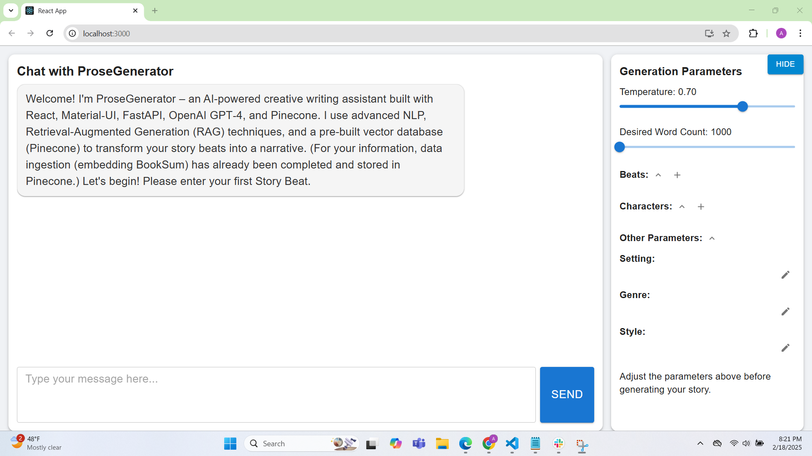
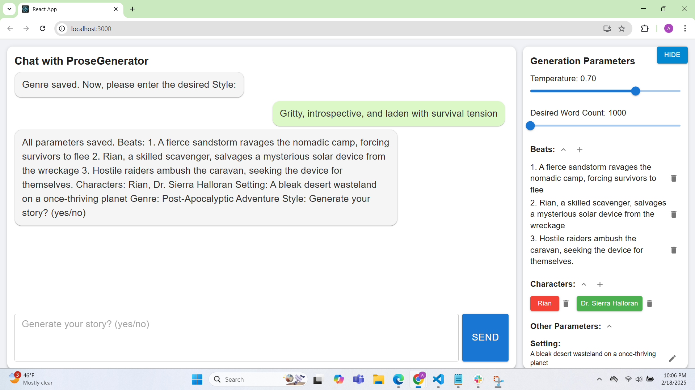
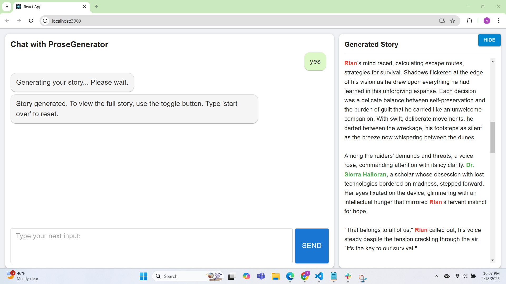

# ProseGenerator





ProseGenerator is a project that transforms a series of story beats and optional metadata (such as characters, setting, genre, and style) into approximately 1500 words of cohesive narrative prose using FastAPI, OpenAI GPT models, and Pinecone for semantic search. The project is organized into two parts:

- **Backend:** Contains the FastAPI application and all the code for generating prose.
- **Frontend:** Frontend application (React)

## Project Structure
```bash
ProseGenerator/
├── README.md
├── backend/
│   ├── .env             # Environment variables (API keys, etc.)
│   ├── Dockerfile       # (Optional) Dockerfile for containerizing the backend
│   ├── environment.yml  # (Optional) Conda environment file
│   ├── main.py          # FastAPI application code
│   ├── requirements.txt # Python dependencies
│   └── (Conda environment: prosegenerator_env)
└── frontend/
```
## Setup Instructions

### 1. Clone or Download the Project

Clone the repository or download the project files into your local system.

### 2. Create and Activate the Conda Environment

Open your terminal, navigate to the `backend` folder, and create a Conda environment:

```bash
cd ProseGenerator/backend
conda create --name prosegenerator_env python=3.9 -y
conda activate prosegenerator_env
```
### 3. Install Python Dependencies
Install the required Python packages using pip:

```bash

pip install -r requirements.txt
```
Alternatively, you can create the environment using the provided environment.yml file:

```bash
conda env create -f environment.yml
conda activate prosegenerator_env
```
### 4. Configure Environment Variables
Create or edit the .env file in the backend folder to include your API keys and other configuration settings. For example:

```ini
PINECONE_API_KEY=your-pinecone-key
OPENAI_API_KEY=your-openai-key
```
### 5. Run the Backend Server
Start the FastAPI application by running:

```bash
uvicorn main:app --reload
Your backend server will start at http://127.0.0.1:8000.
```

### 6. Frontend Setup
You can initialize your frontend application  by navigating to the frontend folder and running:

```bash

cd ../frontend
npm run serve .
```
### 7. Usage
**Backend Endpoint**:
The FastAPI backend exposes an endpoint at /generate-prose that accepts a JSON payload with the following keys:

beats (List of strings)
characters (Optional list of objects, each with name and description)
setting (String)
genre (String)
style (String)
Example payload:

```json
{
  "beats": [
    "Jack and Xander continue their excavation on the lunar surface...",
    "They discover an ancient alien artifact..."
  ],
  "characters": [
    {"name": "Jack", "description": "A veteran lunar miner"},
    {"name": "Xander", "description": "Jack's logical partner"}
  ],
  "setting": "A secluded lunar excavation site overshadowed by corporate exploitation",
  "genre": "Hard Sci-Fi",
  "style": "Dark, suspenseful atmosphere reminiscent of 'Alien'"
}
```
The endpoint returns a JSON response with a prose_output key containing the generated text.

**Contributing**
Feel free to fork the repository and submit pull requests for improvements. For any questions or issues, please open an issue in the repository.
